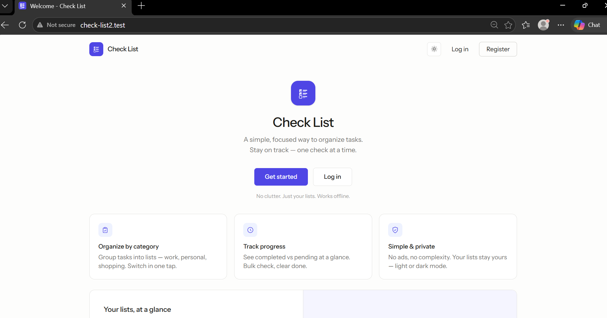
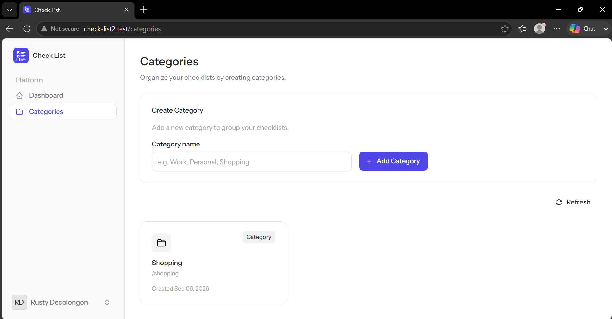
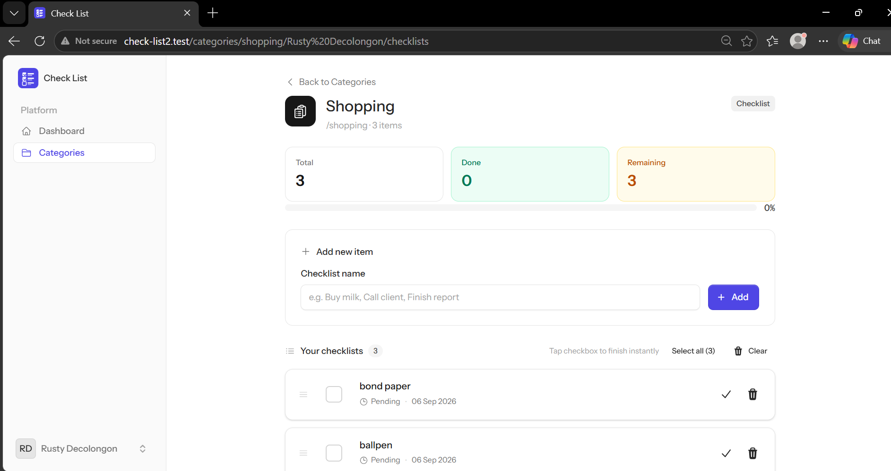

# Check List — Laravel + Livewire

> A simple, focused checklist app built on the **Laravel + Livewire Starter Kit**. Organize tasks into categories, track progress, and stay on top of what matters — one check at a time.

<p align="center">
  
</p>

<p align="center">
  <a href="https://laravel.com"></a>
  <a href="https://livewire.laravel.com"></a>
  <a href="https://fluxui.dev"></a>
  <a href="https://tailwindcss.com"></a>
  
  
</p>

---

## Table of Contents

- [About](#about)
- [Features](#features)
- [Screenshots](#screenshots)
- [Tech Stack](#tech-stack)
- [Requirements](#requirements)
- [Quick Start — Clone & Setup](#quick-start--clone--setup)
- [Setup Variants](#setup-variants)
- [Available Scripts](#available-scripts)
- [Project Structure](#project-structure)
- [Environment Variables](#environment-variables)
- [Database](#database)
- [Routes & Pages](#routes--pages)
- [Customization](#customization)
- [Testing & Quality](#testing--quality)
- [Troubleshooting](#troubleshooting)
- [License](#license)

---

## About

**Check List** is a category-based task manager. Each authenticated user creates **Categories** (e.g. Work, Personal, Shopping) and adds **Checklists** inside them. Items can be finished individually, bulk-finished, reordered via drag-and-drop, paginated with infinite scroll, and tracked with live stats (total / done / remaining / %).

It is built on top of the official **Laravel + Livewire Starter Kit** (`laravel/livewire-starter-kit`) and extends it with:

- `categories` + `check_lists` tables, Eloquent models, and `ChecklistService`
- Livewire 4 full-page components (`pages::categories.category-index`, `pages::check-list.check-list-index`) + presentational child components
- Auth-guarded, user-scoped data (author_id) with Flux UI + Tailwind 4
- Light/dark theme, fully responsive (phone / tablet / desktop)

> Original starter kit docs: <https://laravel.com/docs/starter-kits>

---

## Features

| Area | Details |
|---|---|
| **Categories** | Create categories per user, slug auto-generated (`Str::slug`), displayed as cards in a responsive grid. |
| **Checklists** | Add items per category (unique per user+category), positioned at top, ordered by `position` then `id`. |
| **Progress** | Live stats bar — total, done, remaining, percent (`ChecklistService::stats`). |
| **Interactions** | Toggle finish, delete, clear all, reorder (`wire:sort`), bulk select → **Mark as finished** (toFinish), select-all, infinite load-more (`wire:intersect`). |
| **Auth & Security** | Laravel Fortify (login/register, 2FA, passkeys), `verified` + `auth` middleware, owner checks (`abort_if` 403). |
| **UI** | Flux UI 2, Tailwind 4, Vite Plus, Blaze icons, light/dark toggle persisted in `localStorage`. |
| **Responsive** | Mobile-first layouts, works on 390px → 1440px+ without horizontal scroll. |

---

## Screenshots

> Screenshots live in [`screenshots/`](screenshots/). Placeholders (`*.svg`) are committed — replace them with real captures (`welcome.png`, `categories.png`, `checklist.png`) when ready.

| Welcome Page (`/`) | Categories (`/categories`) | Checklist (`/categories/{slug}/{user}/checklists`) |
|---|---|---|
|  |  |  |

**Tip:** capture at **1440×900** for desktop. To use real images, save as `screenshots/welcome.png` etc. and update the paths above from `.svg` to `.png`.

---

## Tech Stack

| Layer | Technology |
|---|---|
| Backend | **Laravel 13.30**, PHP 8.3+ (tested on 8.4), Fortify 1.39, Chisel 0.1 |
| Frontend | **Livewire 4.4**, **Flux UI 2.18** (free), **Blaze 1.0**, Tailwind 4.3, Vite 8 + Vite Plus 0.3 |
| Auth | Fortify, `laravel/passkeys` (WebAuthn), 2FA via `pragmarx/google2fa` |
| DB | MySQL (default in this repo) — also works with SQLite; see `.env.example` |
| Tooling | Pest 5, PHPStan / Larastan 3, Pint, Vite, Concurrent dev server |

---

## Requirements

- **PHP** `^8.3` (8.4 recommended) + extensions: `mbstring`, `openssl`, `pdo`, `pdo_mysql`/`pdo_sqlite`, `ctype`, `json`, `bcmath`, `fileinfo`
- **Composer** 2.x
- **Node.js** `^20` + **npm** `^10`
- **Database**: MySQL 8+ **or** SQLite (for local quick start)
- **Git**

Check your versions:

```bash
php -v
composer -v
node -v
npm -v
mysql --version
```

---

## Quick Start — Clone & Setup

### 1. Clone the repository

```bash
# HTTPS (recommended for most users)
git clone https://github.com/Decolongon/check-list.git

# — or SSH —
git clone git@github.com:Decolongon/check-list.git

# — or GitHub CLI —
gh repo clone Decolongon/check-list

cd check-list
```

> The default branch is `master`. If you cloned a fork, replace the URL with your fork's URL.

### 2. Install dependencies & scaffold (one command)

This project ships a `composer setup` shortcut that does `composer install`, `.env` copy, `key:generate`, `migrate`, `npm install`, and `npm run build`:

```bash
composer setup
```

### 3. Configure environment

```bash
# If composer setup didn't create .env (already exists), do:
copy .env.example .env   # Windows (PowerShell/CMD)
# cp .env.example .env   # macOS / Linux

php artisan key:generate
```

Edit `.env` — at minimum set:

```dotenv
APP_NAME="Check List"
APP_URL=http://localhost:8000

# SQLite (zero-config local)
DB_CONNECTION=sqlite
# DB_DATABASE is file path — create if missing:
# (PowerShell)  New-Item -ItemType File -Path database/database.sqlite -Force
# (bash)        touch database/database.sqlite

# — or MySQL —
# DB_CONNECTION=mysql
# DB_HOST=127.0.0.1
# DB_PORT=3306
# DB_DATABASE=check_list
# DB_USERNAME=root
# DB_PASSWORD=
```

### 4. Migrate & (optional) seed

```bash
php artisan migrate --force
# php artisan db:seed   # if you add seeders later
```

### 5. Build frontend

```bash
npm install
npm run build   # production
# npm run dev   # dev with HMR (Vite)
```

### 6. Run the app

**Option A — single command (recommended):**

```bash
composer dev
```

This runs (via `concurrently`) the Laravel dev server, queue listener, pail logs, and Vite HMR together. See `composer.json` → `scripts.dev` and `artisan dev`.

**Option B — separate terminals:**

```bash
# Terminal 1
php artisan serve          # http://localhost:8000

# Terminal 2
npm run dev                # Vite HMR
```

Open **http://localhost:8000** → Register → Create a Category → Open it → Add checklists.

---

## Setup Variants

### SQLite (fastest local setup)

```dotenv
DB_CONNECTION=sqlite
```

```bash
# Windows PowerShell
if (!(Test-Path database/database.sqlite)) { New-Item -ItemType File -Path database/database.sqlite -Force | Out-Null }
php artisan migrate --graceful

# macOS / Linux
touch database/database.sqlite
php artisan migrate --graceful
```

### MySQL (Laragon / XAMPP / Docker)

```dotenv
DB_CONNECTION=mysql
DB_HOST=127.0.0.1
DB_PORT=3306
DB_DATABASE=check_list
DB_USERNAME=root
DB_PASSWORD=
```

```bash
# Create DB first (via Laragon, phpMyAdmin, or CLI):
mysql -u root -e "CREATE DATABASE IF NOT EXISTS check_list CHARACTER SET utf8mb4 COLLATE utf8mb4_unicode_ci;"
php artisan migrate
```

### Laravel Sail (Docker)

```bash
composer require laravel/sail --dev
php artisan sail:install   # choose mysql
./vendor/bin/sail up -d
./vendor/bin/sail artisan migrate
./vendor/bin/sail npm install
./vendor/bin/sail npm run dev
```

---


## Environment Variables

See [`.env.example`](.env.example) for the full list. Common overrides:

```dotenv
APP_NAME="Check List"
APP_ENV=local
APP_DEBUG=true
APP_URL=http://localhost:8000

DB_CONNECTION=sqlite        # or mysql
CACHE_STORE=database
SESSION_DRIVER=database
QUEUE_CONNECTION=database
MAIL_MAILER=log             # use smtp/mailpit in production
VITE_APP_NAME="${APP_NAME}"
```

---

## Database

- Default connection is `sqlite` in `.env.example`; this repo's current DB is **MySQL** (see `database` in `boost.json`).
- Migrations: `php artisan migrate`, `php artisan migrate:fresh`, `php artisan migrate:rollback`.
- No default seeders — register via UI or `php artisan tinker`.

---


## Testing & Quality

```bash
php artisan test                 # Pest
vendor/bin/pint --parallel       # format
vendor/bin/pint --parallel --test
vendor/bin/phpstan analyse       # Larastan
composer ci:check                # full CI gate (clear + lint:check + types:check + test)
```
---

## License

The Laravel + Livewire starter kit is open-sourced software licensed under the [MIT license](https://opensource.org/licenses/MIT). This project's additional code (categories/checklists) is also MIT unless stated otherwise.

---

<p align="center"><sub>Built with Laravel, Livewire, Flux UI & Tailwind — Simple lists, done.</sub></p>
